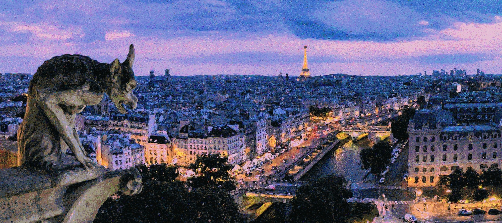
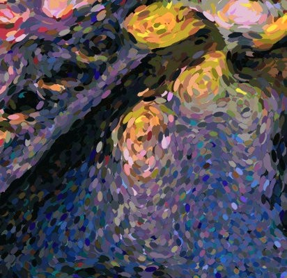
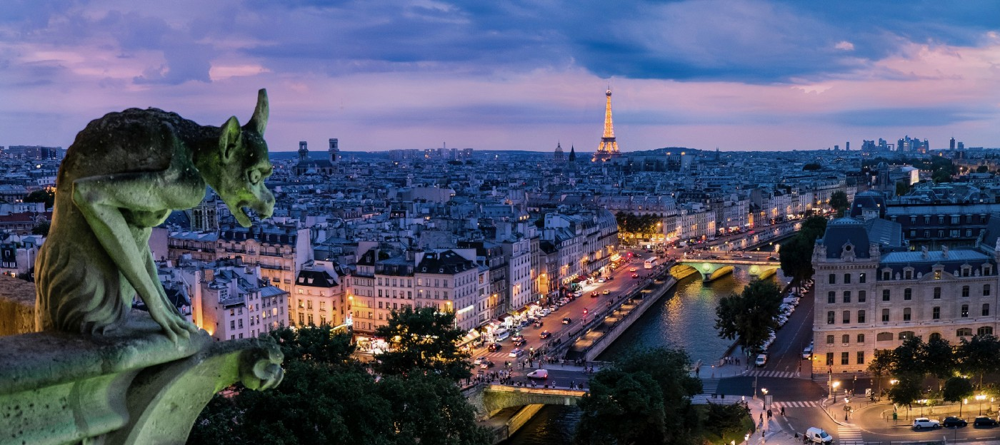
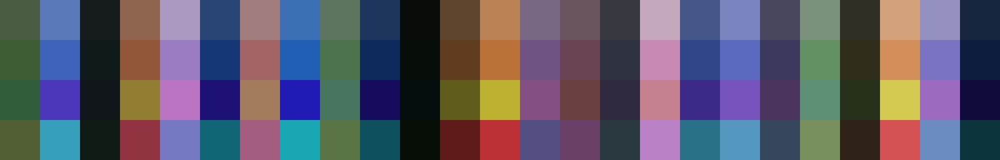
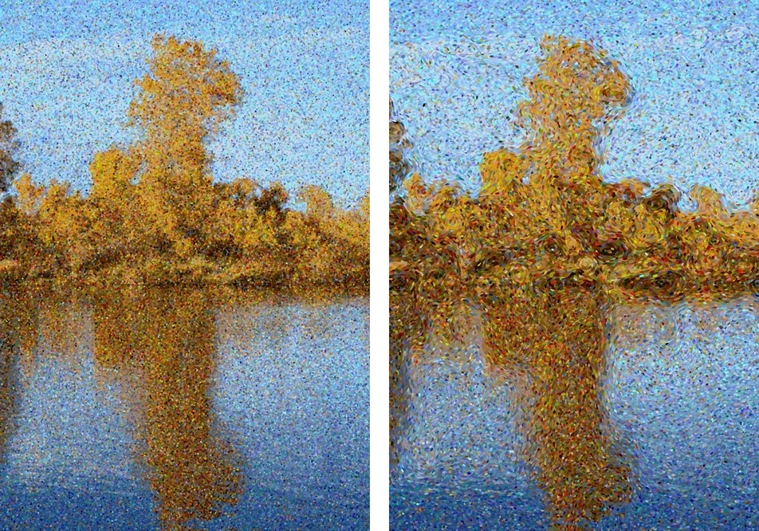
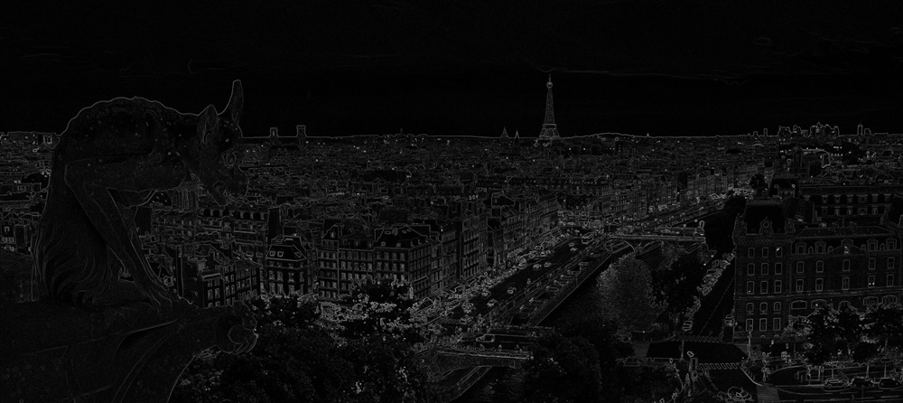

# Pointillism
This repo contains a python application that converts a photo to a pointillist painting.

- [Pointillism](#pointillism)
  - [Installation](#installation)
- [Creating Pointillist Paintings with Python and OpenCV](#creating-pointillist-paintings-with-python-and-opencv)
  - [Simulating the Painting Process](#simulating-the-painting-process)
    - [Color Palette Creation](#color-palette-creation)
    - [Stroke direction and length computation](#stroke-direction-and-length-computation)
  - [The Painting Process](#the-painting-process)
  - [The Code](#the-code)

## Installation

```
git clone git@github.com:matteo-ronchetti/Pointillism.git
cd Pointillism
pip install -r requirements.txt
```

# Creating Pointillist Paintings with Python and OpenCV

_The final result_



One of my favorite painting techniques is pointillism, a technique of painting in which small distinct dots of color are applied in patterns to form an image.

This technique relies on the ability of the eye and mind of the viewer to blend the color spots into a fuller range of tones. The juxtaposition of different colors make them more vivid, giving the whole image more vibrancy.

_Notice the juxtaposition of colors_



Pointillism is a gorgeous technique, but in order to make these types of paintings, you need to take a methodical and long approach. Not to mention, you need to be a skilled painter!

As a computer vision developer, I know a lot about processing images — but let’s face it, I’m terrible at drawing.

During my trip to Paris I was inspired to try to emulate pointillists using [Python](https://hackernoon.com/tagged/python) and [OpenCV](https://hackernoon.com/tagged/opencv). In this post I will guide you through the approach I developed and the code I’ve written to produce images like the one at the top of this blog post.

## Simulating the Painting Process

The painting process simulation is done in three steps:

 1. Color palette creation
 2. Stroke size and length computation
 3. Actual painting

As an example I’ve chosen a beautiful picture of Paris from [https://unsplash.com](https://unsplash.com) a website where you can get free pictures of amazing quality. I’ve preprocessed the image with The Gimp to reduce the green shades on the gargoyle and to upscale the Tour Eiffel to make it more eye catching. In general doing a little bit of preprocessing, especially increasing the general saturation, helps getting more pleasing results.



### Color Palette Creation

First thing we need to decide which colors will be in the palette of our “virtual artist”. We need to choose a set of colors that is coherent with the colors of the image but yet vivid and distinct.

We start by running [k-means](https://en.wikipedia.org/wiki/K-means_clustering) to select n=20 dominant colors from the image. The “adversarial” nature of k-means produces distinct colors that concentrates around the most frequent colors in the image.

To add vibrancy we augment the palette by adding some variations of the colors chosen by kmeans. I’ve chosen to add a more saturated version of the base palette, and two small variations in the colors (± 20 hue) with a little bit of added saturation.

The first row of the following image represents the palette computed by kmeans, the subsequent rows contains the color variations included in the final palette.

_The color palette computed by kmeans and augmented to be more vibrant_



### Stroke direction and length computation

To give our final result a more dynamic look we can use small distinct strokes of color instead of circular dots. This is actually a technique used in a lot of pointillist paintings! We want the direction of the brush strokes to be coherent with the content of the image and to use longer strokes to depict edges. For this reason we use the image gradient to decide the length and direction of each paint stroke.

_Comparison of style of painting: dots (left), small strokes (right)_



To compute the direction and length of the brush strokes we take the Scharr image derivative on the x and y axis thus defining a vector field over the image. We then smooth this field using Gaussian blur to give a more coherent look to the final “painting”.

_A visualization of the magnitude of image gradient_



## The Painting Process

We paint the final results just like a real artist, one stroke at a time! For each stroke we have to decide:

 1. The position
 2. The orientation and length of each stroke
 3. Which color of the palette to use

It may be tempting to chose a random position but this approach has a major drawback: we don’t know when we have painted enough strokes to fill the entire image. So we create a list of strokes positions by sampling uniformly over the image, we add a little bit of random noise to each position and we shuffle the list to give the strokes a random order.

```python
def randomized_grid(h, w, scale):
    r = scale//2

    grid = []
    for i in range(0, h, scale):
        for j in range(0, w, scale):
            y = random.randint(-r, r) + i
            x = random.randint(-r, r) + j
            grid.append((y % h, x % w))

    random.shuffle(grid)
    return grid
```

The direction and length are easy to compute once we have defined a vector field over the image using the image gradient.

```python
angle = math.degrees(gradient.direction(y, x)) + 90
length = int(round(stroke_scale + stroke_scale * math.sqrt(gradient.magnitude(y, x))))
```

We rotate the direction of the gradient by 90 degrees because we want the strokes to be parallel to the image edges (the image gradient is perpendicular to the edges). The length is computed depending on the magnitude (i.e. strength) of the image gradient. Here *stroke_scale *is a parameter that specify the global scale for the strokes, the square root is used to make the strokes more uniform. We don’t want to have too much variance in the length of the strokes.

The choice of the stroke color is probably the hardest part. We want it to be random to get that beautiful juxtaposition of colors, yet we want to be consistent with the source photo. The idea is to chose a color randomly from the palette, giving the colors that are more similar to the underling pixel of the photo a greater probability of being chosen. The probabilities are determined using a [softmax](https://en.wikipedia.org/wiki/Softmax_function) function of the similarities between colors.

## The Code

You can find the [source code here](https://github.com/matteo-ronchetti/Pointillism). You can find more information about me on my website [https://matteo.ronchetti.xyz](https://matteo.ronchetti.xyz)
