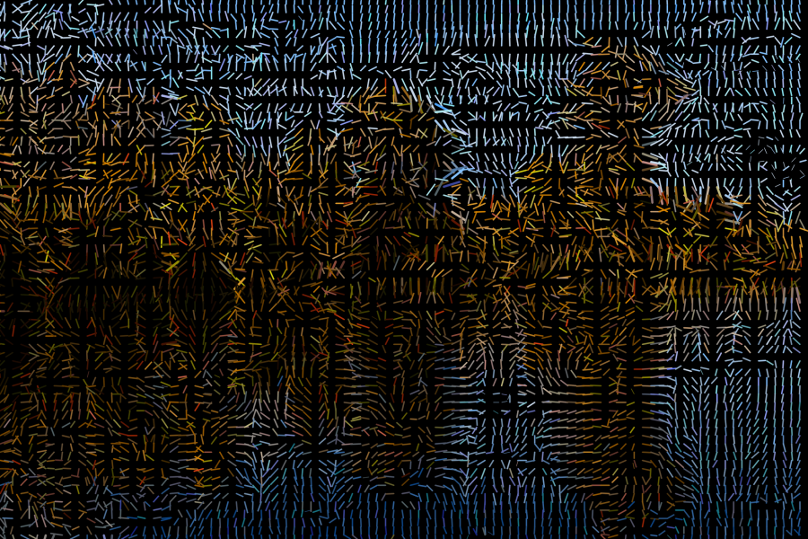
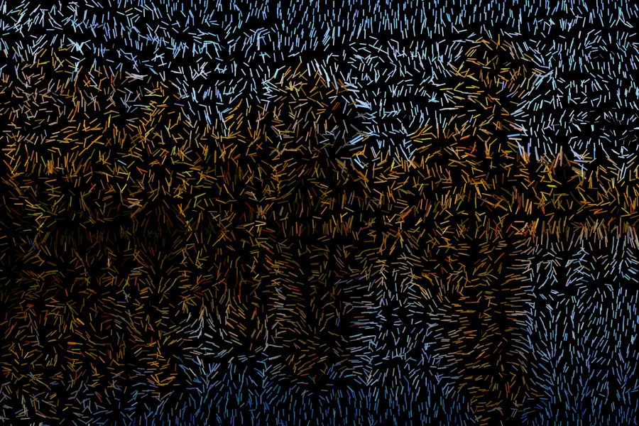

# Lines

```python
grid = normal_grid(img.shape[0], img.shape[1], scale=20)
```

```python
cv2.line(res, 
    pt1=(x, y),
    pt2=(int(x + math.cos(angle) * length), int(y - math.sin(angle) * length)),
    color=color,
    thickness=thickness=int(math.sqrt(length) / 2),
    lineType=cv2.LINE_AA)
```



## Randomized grid
```python
grid = randomized_grid(img.shape[0], img.shape[1], scale=20)
```


